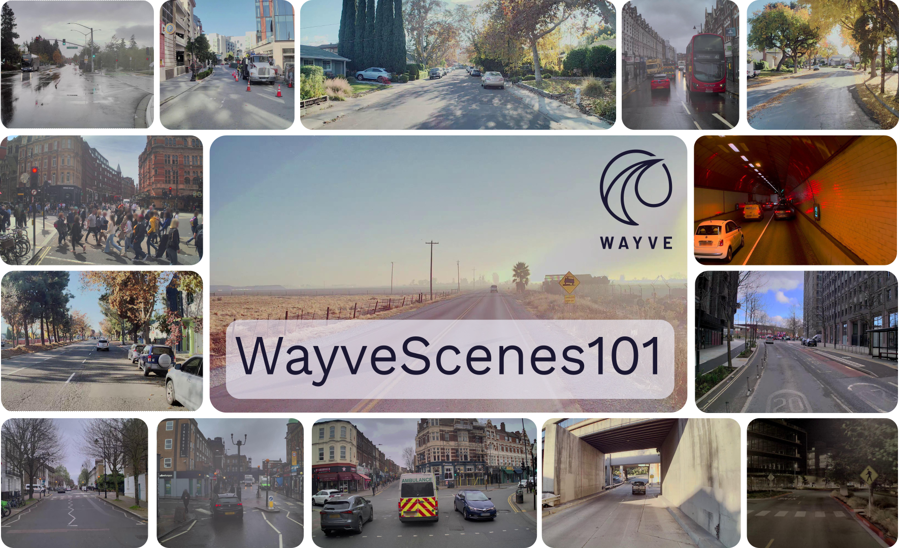
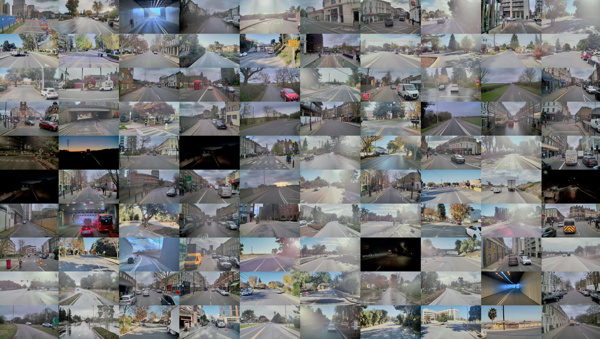
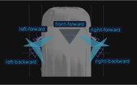

# WayveScenes101 Dataset

## About the Dataset


We release the WayveScenes101 Dataset to advance research in novel view synthesis and scene reconstruction for autonomous driving applications. This dataset features a diverse collection of high-resolution images and corresponding camera poses, offering scenes across diverse locations, traffic conditions, and environmental conditions.

Our dataset uniquely targets applications of novel view synthesis models for driving scenarios and offers features which are not commonly found in existing datasets. The dataset is offering scenes across diverse locations, environmental conditions, and driving situations. A high frame rate of 10 frames per second for each camera allows for more accurate scene reconstruction, in particular for dynamic scenes. We provide an evaluation protocol for a held-out evaluation camera to specifically measure off-axis reconstruction quality, which is crucial for estimating the generalisation capabilities of novel view synthesis models. Furthermore, we provide metadata for each scene to allow a detailed breakdown of model performance for specific scenarios, such as nighttime or rain.


### Key Metrics

> 101 highly diverse driving scenarios of 20 seconds each

> 101,000 images (101 scenes x 5 cameras x 20 seconds x 10 frames per second)

> Scene recording locations: US and UK

> 5 time-synchronised cameras

> Separate held-out evaluation camera for off-axis reconstruction measurement

> Scene-level attributes for fine-grained model evaluation

> Simple integration with the NerfStudio framework


### Scene Diversity

Our scenes feature a wide range of conditions, including:

- **Weather**: Sunny, cloudy, overcast, rain, fog
- **Road Types**: Highway, urban, residential, rural, roadworks
- **Time of Day**: Daytime, low sun, nighttime
- **Dynamic Agents**: Vehicles, pedestrians, cyclists, animals
- **Dynamic Illumination**: Traffic lights, exposure changes, lens flare, reflections





## Dataset Download

We made our WayveScenes101 dataset available [on Google Drive](https://drive.google.com/drive/u/1/folders/1XXlhGut7c5PVeBj4qwORlHoGdeSYxGgt). You may decide to download all of the provided scenes or only a subset of them.


### Downloading the full dataset with gdown

If you wish to download the full dataset in one go with  `gdown`, please run the following commands:

```bash
pip install gdown
gdown --folder 1XXlhGut7c5PVeBj4qwORlHoGdeSYxGgt -O /path/to/wayve_scenes_101 --remaining-ok 
```


## Dataset Usage

For instructions on how to view and inspect the dataset, please follow the tutorial in `tutorial/dataset_usage.ipynb`.


## Package Installation

> Note: This project is currently supported only on Linux operating systems.

This guide assumes that you have Anaconda or Miniconda already installed on your system. If not, please install Anaconda from [here](https://www.anaconda.com/products/distribution) or Miniconda from [here](https://docs.conda.io/en/latest/miniconda.html).


### Creating a Conda environment

To set up your environment, follow these steps:

1. **Clone the repository**

    First, clone the repository to your local machine using Git:

    ```bash
    git clone https://github.com/wayveai/wayve_scenes.git
    cd wayve_scenes
    ```

2. **Prepare the Conda Environment**

    Create a new Conda environment (defaults to Python3.10). This step may take a while.

    ```bash
    conda env create -f environment.yml
    ```

    Activate the newly created environment:

    ```bash
    conda activate wayve_scenes_env
    ```

    Finally, we want to also install pytorch3d
    ```bash
    pip install git+https://github.com/facebookresearch/pytorch3d.git
    ```


3. **Install the `wayve_scenes` Package**

Once your environment is created and activated, you can install the project by running:

```bash
cd src
python -m pip install -e .
```

This command installs the package in editable mode (`-e`), which means changes to the source files will immediately affect the installed package without needing a reinstall.


### Verifying the Package Installation

After installation, you can verify that the package has been installed correctly by running:

```bash
python -c "import wayve_scenes;"
```

If no output is printed, the `wayve_scenes` package can be imported and you are good to go!


## Novel View Synthesis Model Evaluation

For references on how to evaluate novel view synthesis models trained on scenes from our dataset, please follow the tutorial in `tutorial/evaluate.ipynb`.


## Camera Images

Our recording rig has 5 different time-synchronised cameras.
The camera names are:
- `front-forward`
- `left-forward`
- `right-forward`
- `left-backward`
- `right-backward`

The camera arrangement on the vehicle is illustrated below.



### Camera Info

- Shutter: Rolling Shutter
- Distortion model: Fisheye Distortion
- Resolution: 1920 x 1080 pixels
- Temporal resolution: 10 Hz
- Calibration: We provide both extrinsic and intrinsic camera calibration for all scenes as part of the COLMAP files. We also provide metric camera poses in `data/camera_transforms.json`

### Masks

We provide binary masks for all images in the dataset, indicating the position of annotations used for blurring of license plates and faces for data anonymisation. These masks also mark regions where the ego-vehicle is visible in the camera images.


## Contribute

If you encounter issues or need support, please report them as an issue in this repository, or feel free to submit a pull request.


## Coming Soon

We're planning to host a public challenge with new scenes and an evaluation server soon. Stay tuned!


## Updates

### June 17, 2024: Initial Release

We release the first version of the dataset.

## Citation

@misc{zürn2024wayvescenes101datasetbenchmarknovel,
      title={WayveScenes101: A Dataset and Benchmark for Novel View Synthesis in Autonomous Driving}, 
      author={Jannik Zürn and Paul Gladkov and Sofía Dudas and Fergal Cotter and Sofi Toteva and Jamie Shotton and Vasiliki Simaiaki and Nikhil Mohan},
      year={2024},
      eprint={2407.08280},
      archivePrefix={arXiv},
      primaryClass={cs.CV},
      url={https://arxiv.org/abs/2407.08280} 
}


## Dataset Metadata
The following table is necessary for this dataset to be indexed by search
engines such as <a href="https://g.co/datasetsearch">Google Dataset Search</a>.


<div itemscope itemtype="http://schema.org/Dataset">
<table>
  <tr>
    <th>property</th>
    <th>value</th>
  </tr>
  <tr>
    <td>name</td>
    <td><code itemprop="name">WayveScenes101</code></td>
  </tr>
  <tr>
    <td>alternateName</td>
    <td><code itemprop="alternateName">WayveScenes101</code></td>
  </tr>
  <tr>
    <td>url</td>
    <td><code itemprop="url">https://wayve.ai/science/wayvescenes101/</code></td>
  </tr>
  <tr>
    <td>description</td>
    <td><code itemprop="description">An autonomous driving dataset made for novel view synthesis.</code></td>
  </tr>
  <tr>
    <td>provider</td>
    <td>
      <div itemscope itemtype="http://schema.org/Organization" itemprop="provider">
        <table>
          <tr>
            <th>property</th>
            <th>value</th>
          </tr>
          <tr>
            <td>name</td>
            <td><code itemprop="name">Wayve Technologies Ltd</code></td>
          </tr>
          <tr>
            <td>sameAs</td>
            <td><code itemprop="sameAs">https://wayve.ai/</code></td>
          </tr>
        </table>
      </div>
    </td>
  </tr>
  <tr>
    <td>license</td>
    <td>
      <div itemscope itemtype="http://schema.org/CreativeWork" itemprop="license">
        <table>
          <tr>
            <th>property</th>
            <th>value</th>
          </tr>
          <tr>
            <td>name</td>
            <td><code itemprop="name">WayveScenes101 Dataset Licence Agreement for Non-Commercial Use (June 2024)</code></td>
          </tr>
          <tr>
            <td>url</td>
            <td><code itemprop="url">https://wayve.ai/wp-content/uploads/2024/06/WayveScenes101-Dataset-Licence-Agreement.pdf</code></td>
          </tr>
        </table>
      </div>
    </td>
  </tr>
</table>
</div>
